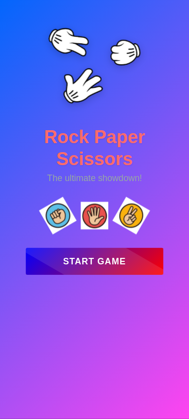

# Rock Paper Scissors Game 🎮✊✋✌️

A fun and colorful Rock Paper Scissors game built with React and Ionic Framework.




## Features ✨

- 🎨 Vibrant UI with animations and gradients
- 📊 Score tracking and game history
- 🤖 Computer opponent with "thinking" animation
- 📱 Fully responsive mobile-friendly design
- 🏆 Win/lose/draw indicators with fun emojis
- 🔄 Game reset functionality
- 🕹️ Three gameplay modes: Rock, Paper, Scissors

## Installation ⚙️

1. Clone the repository:
   ```bash
   git clone https://github.com/your-username/rock-paper-scissors.git
   cd rock-paper-scissors
   ```
